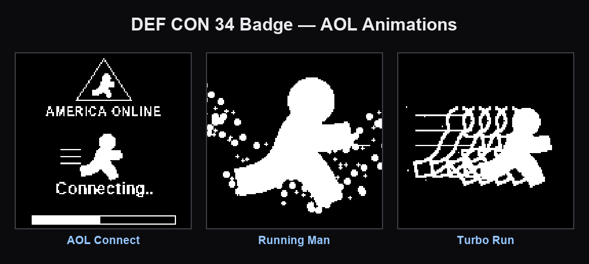
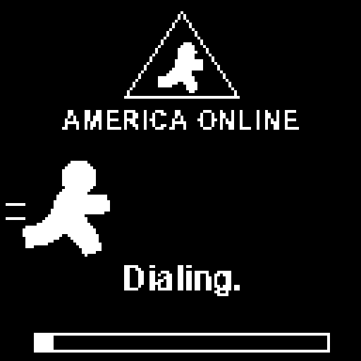
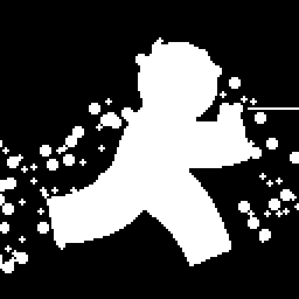

# AOL Running-Man Animations for the DEF CON 34 Badge

Three 90s-flavored **AOL** animations — the dial-up sign-on and the iconic AOL
running man — looping on your DEF CON 34 badge's 128×128 1-bit OLED.

<p align="center">
  
</p>

**…and animated:**

<p align="center">
  
  
  
</p>

<p align="center"><em>
  AOL Connect &nbsp;·&nbsp; Running Man &nbsp;·&nbsp; Turbo Run<br>
  (4× upscales of exactly what the 1-bit panel shows)
</em></p>

The player cycles all three in a loop. Each one:

1. **AOL Connect** — *Dialing… → Connecting… → Connected!* with the running-man pyramid logo and a filling progress bar (rebuilt from the classic Tenor sign-on gif).
2. **Running Man** — the AOL running man bobbing in place while a dotted speed-trail streams past (from the R29 running-man art).
3. **Turbo Run** — the running man *blasts* across the screen with a comic-book motion trail of fading ghost-echoes, then loops back in.

---

## What this is

The DC34 badge (Baochip-1x running [Xous](https://github.com/betrusted-io/xous-core), SH1107 128×128 **1-bit** OLED) can't play animated images — the panel shows one static bitmap at a time and there's no GIF decoder on the chip. So animation here is a **flipbook**: a stream of pre-rendered 1-bit frames blitted back-to-back.

This repo gives you both halves:

- **`generate/`** — Python scripts that *draw* each frame procedurally with Pillow and pack them into a `*_frames.bin` the badge plays directly. Tweak the code, get a new animation.
- **`player/`** — a small Rust module for the badge's `dc34-vault` app that loops the baked frames forever, keeps the watchdog fed, and powers off on a button press. Prebuilt `.bin` frames are included, so you can flash without running Python at all.

> ⚠️ **Heads-up before you flash:** putting custom firmware on the badge **wipes its light-encryption key and forces developer mode** (you lose the QR light-mixing game). That's inherent to the custom-firmware route — bunnie's no-wipe `dc34-image` tool only takes a *single static* image, not animation. If you only want a still picture, use that instead.

## Repo layout

```
dc34-aol-badge/
├── generate/
│   ├── gen_aol_connect.py    # dial-up sign-on (running-man pyramid + progress bar)
│   ├── gen_running_man.py    # AOL running man, bobbing, with speed-trail
│   ├── gen_turbo_run.py      # running man dashing across with a motion trail
│   └── src_img/
│       └── man_silhouette.png # the AOL running man (used by all three)
├── player/
│   ├── player.rs             # Xous flipbook player (drop into dc34-vault/src/)
│   ├── anim/                 # prebuilt frame streams (baked into the firmware)
│   │   ├── aol_connect_frames.bin
│   │   ├── running_man_frames.bin
│   │   └── turbo_run_frames.bin
│   └── BUILD.md              # full build + flash instructions
├── preview/                  # 4× GIF previews + contact sheets (what you see above)
├── requirements.txt
└── LICENSE
```

## Quick start

**Just want it on your badge?** The frames are already built — go straight to [`player/BUILD.md`](player/BUILD.md).

**Want to regenerate or tweak the animations?**

```bash
pip install -r requirements.txt
cd generate
python gen_aol_connect.py    # -> out/aol_connect_preview.gif + out/aol_connect_frames.bin
python gen_running_man.py    # -> out/running_man_*
python gen_turbo_run.py      # -> out/turbo_run_*
```

Each script prints the frame count + file sizes and drops a `*_preview.gif` (4× upscale to eyeball on your computer), a `*_sheet.png` contact sheet, and the packed `*_frames.bin`. Copy a `.bin` into `player/anim/`, rebuild the firmware ([BUILD.md](player/BUILD.md)), and reflash.

## Make your own animation

Every generator is one self-contained file that builds a Python list of 128×128 PIL frames, then packs them. To roll your own:

1. Copy a `gen_*.py`, draw whatever you like into each frame (white = lit pixel).
2. Keep the same packing at the bottom — **each frame is 512 little-endian `u32` words** (128×128 / 32 = 512), in the bit order the badge's `Gfx::bitmap` expects (H-mirrored, matching `dc34-vault/src/bitmaps/pngtorust.py`).
3. Add your `.bin` to `player/anim/`, then in `player.rs` add an `include_bytes!` and a `Clip { data, fps, repeats }` entry to `PLAYLIST`.

Want to convert an **existing animated GIF** instead of drawing frames? PIL can walk a GIF (`ImageSequence.Iterator`), resize each frame to 128×128, threshold to 1-bit (optionally dither), and pack with the same routine — a small addition to the generators.

## Frame format (for the curious)

- Panel: 128×128, 1 bit per pixel. White = lit.
- One frame = 128×128 bits = 2048 bytes = **512 `u32` words**, little-endian.
- A `.bin` is just those frames concatenated. `player.rs` reads it in 2048-byte chunks and pushes each to the OLED at the clip's `fps`.
- Bit/word order matches bunnie's `pngtorust.py` in `dc34-vault`, so anything that tool would accept lines up with these frames.

## Credits

- Badge, `dc34-vault`, and the `pngtorust.py` frame format: **bunnie** & the DEF CON 34 / Baochip team.
- Xous: the **betrusted-io** project.
- AOL animation art + this player: community-made, for fun. Not affiliated with or endorsed by AOL.

## License

[MIT](LICENSE) — do whatever you like; a credit link back is appreciated.
